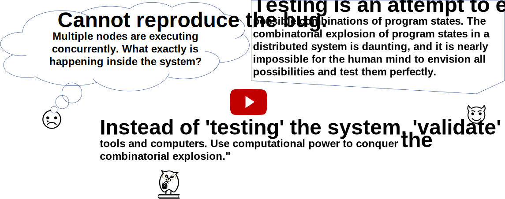
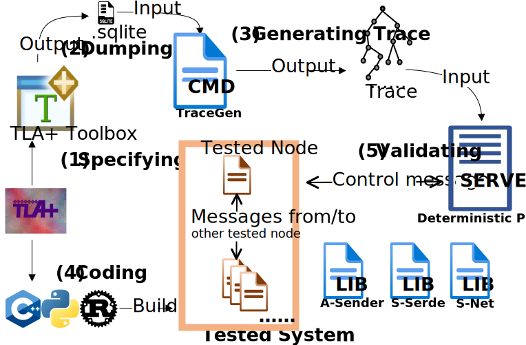

# sedeve-kit

Developing distributed systems is challenging due to the complexities of ensuring correctness with existing concurrency and faults. 
**S**p**e**cification-**D**riv**e**n De**ve**lopment **Kit**(sedeve-kit) tackles these challenges and facilitates development.
Using it comprises three key stages:
Algorithm design and specification: We create an abstract algorithm and define its specifications and invariance using a formal language. This stage enables us to verify the algorithm and generate test cases for subsequent development stages.
Code development: We write the code according to the established specifications, ensuring a consistent and accurate implementation.
System testing: Upon completing the coding process, we rigorously test the system using the test cases generated in the initial stage.
By maintaining a connection between abstract design and concrete implementation, we can confidently guarantee the quality of our system. This approach ensures our design's accuracy and fosters consistency throughout the development process, ultimately resulting in a reliable and high-quality distributed system.

## Bridge the gap between design and implementation

To bridge the gap between design and implementation,
the tool makes the implementation a precise refinement of the design. 
Think of the design as a low-resolution animation, containing only the keyframes. The implementation, on the other hand, is a high-definition animation that not only preserves the keyframes but also adds more details. This ensures a seamless transition from concept to reality and aligns the original design while adding the necessary details for the implementation.

## Architecture

The architecture of **sedeve-kit** is as the following figure, which includes the following components:

**TraceGen**： generating trace/test case

**Deterministic Player**: Run deterministic testing controlled by the test case

**S-Serde**: Serialized/Deserialized message

**S-Net**: Library to build network channel

## Workflow

First, we initiate the design by [using I/O automata to model the system](doc/model_the_system.md) at the abstract level.
Then we use TLA+ to specify the design(__Step (1)__ in Architecture Figure). 

Next, we run a model checker on this specification and ensure they pass the model-checking process(__Step (2)__), guaranteeing correctness at the abstraction level.
At the same time, the model checker generates a model, then we use [sedeve_trace_gen](https://github.com/scuptio/sedeve-kit/blob/main/src/trace_gen/main.rs) to generate the trace set by [finding all possible path algorithm](doc/generate_trace_algorithm.md)(__Step (3)__).

We then write the code based on the specification and [map the logical model to the physical system](doc/from_design_to_code.md).
We incorporate **anchor macros** at appropriate source locations(__Step (4)__). 
During the testing, these macros establish a communication channel with the **Deterministic Player** and reorder actions in a predetermined order as the trace steps generated by the specification.
When the program is compiled for release, the macros are left empty and have no effect.

Finally, we test the system using our **Deterministic Player** and check the result to detect the inconsistency between specification and implementation by conducting [deterministic testing](doc/deterministic_testing.md)(__Step (5)__). 

We repeat this procedure until all the test cases pass successfully.

This process is iterative and can evolve continuously. 

To use the kit, see [how to start](doc/how_to_start.md).

