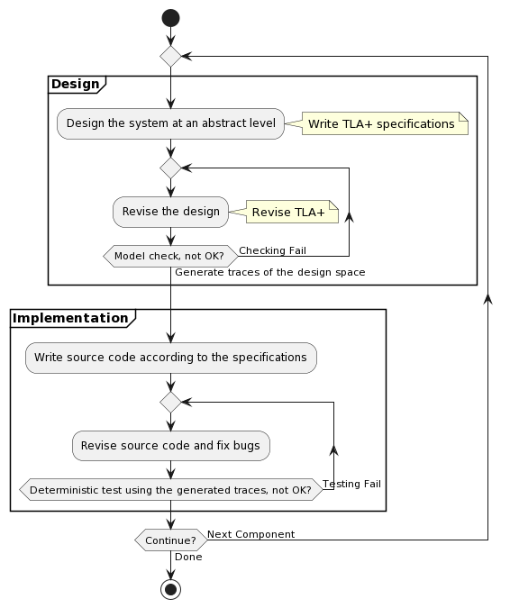

# sedeve-kit

Developing distributed systems is challenging due to the complexities of ensuring correctness with existing concurrency and faults. 
**S**p**e**cification-**D**riv**e**n De**ve**lopment **Kit**(sedeve-kit) tackle these challenges and facilitate development.
Using it comprises three key stages:
Algorithm design and specification: We create an abstract algorithm and define its specifications and invariance using a formal language. This stage enables us to verify the algorithm and generate test cases for subsequent development stages.
Code development: We write the code according to the established specifications, ensuring a consistent and accurate implementation.
System testing: Upon completing the coding process, we rigorously test the system using the test cases generated in the initial stage.
By maintaining a connection between abstract design and concrete implementation, we can confidently guarantee the quality of our system. This approach ensures our design's accuracy and fosters consistency throughout the development process, ultimately resulting in a reliable and high-quality distributed system.

## Architecture

The architecture of **sedeve-kit** is as the following figure.

## Workflow

The workflow for building a system using **sedeve-kit** is as the following figure.

First, we initiate the design by [using I/O automata to model the system](doc/model_the_system.md) at abstract level.
Then we use TLA+ to specify the design(__Setp (1)__ in Architecture Figure). 

Next, we run a model checker on this specification and ensure they pass the model-checking process(__Setp (2)__), guaranteeing correctness at the abstraction level.
At the same time, the model checker generates a test case and trace set(__Setp (3)__).

We then write the code based on the specification and [map logical model to physical system](doc/from_design_to_code.md).
We incorporate **anchor macros** at appropriate source locations(__Setp (4)__). 
During the compilation for testing purposes, these macros establish a communication channel with the **Deterministic Player** and reorder actions in a predetermined order generated by the specification.
When the program is compiled for release, the macros become empty and have no effect.

Finally, we test the system using our **Deterministic Player** and the trace test case se`t(__Setp (4)__). 
We repeat this procedure until all the test cases pass successfully.

This process is iterative and can evolve continuously. 

To use the kit, see [how to start](doc/how_to_start.md).

