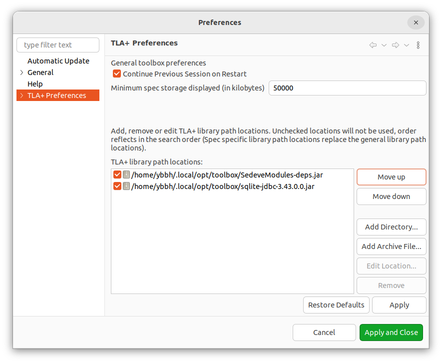

Before writing a TLA+ specification,
you need to configure the [TLA+ toolbox](https://lamport.azurewebsites.net/tla/toolbox.html) to install additional dependent community modules.

Follow these steps to set it up:

1. Download [SedeveModules](https://github.com/scuptio/SedeveModules/releases).
   SedeveModules include modules:
   [StateDB](https://github.com/scuptio/SedeveModules/blob/master/modules/StateDB.tla),
   [GenID](https://github.com/scuptio/SedeveModules/blob/master/modules/GenID.tla) .

   Download [CommunityModules](https://github.com/tlaplus/CommunityModules/releases)
   
   Download [SQLite JDBC driver](https://github.com/xerial/sqlite-jdbc/releases/download/3.45.3.0/sqlite-jdbc-3.45.3.0.jar), SedeveModules save state space to SQLite DB file.

3. In tla+ toolbox, go to

   File -> Preferences -> TLA+ Preference

   Specify TLA+ library path option of *SedeveModules*,  *SQLite JDBC driver*, *CommunityModules*

   
