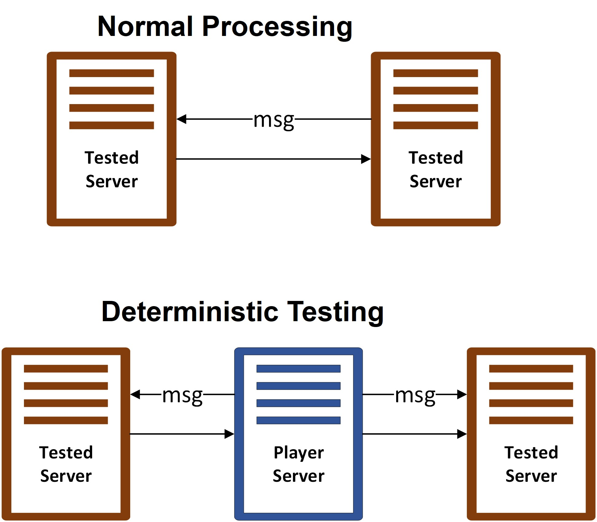

# Run deterministic testing

When running deterministic testing, the message channel would be taken over by the *deterministic player*.

The figure below illustrates how the *deterministic player* reorders the actions based on predefined orders.

The physical system will align with the logical model, ensuring consistency.
Our framework incorporates various macros to facilitate the implementation of *anchor actions*
that verify the coherence between our source-level implementation and abstract-level design.

# How to detect inconsistency between specification and implementation

Each test case is represented as a trace, a finite sequence of action and state pairs, the state corresponding to the results from those actions. Formally, a trace $T$ is a sequence defined as:
    
$${a_1, \pi_1, a_2, \pi_2, ... a_n, \pi_n}$$
    
where $a_i$ is the $i$th  action of the trace, and ${\pi_i}$ is the system's state after executing action ${a_i}$.
The player processes each action ${a_i}$ in sequence $T$. After executing action ${a_i}$, it verifies the system state by asserting that its current state matches the expected state  ${\pi_i}$. 
If the system receives an action ${a_i}$ , then it yields an action $`{a'_{i+1} }`$ that does not match the expected following action $`{a_{i+1}}`$, the testbed will trigger a timeout to report the inconsistency. 
