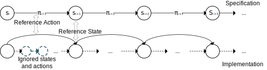
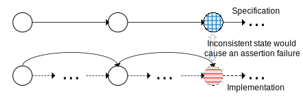
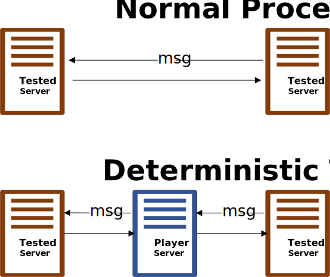
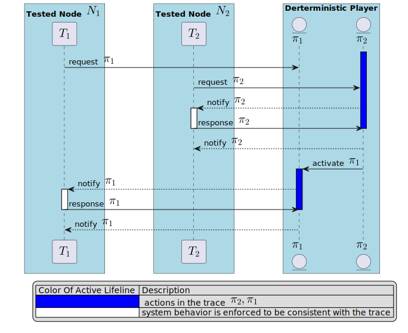

# How to detect inconsistency between specification and implementation

Each test case is represented as a **trace**, a finite sequence of action and state pairs, the state corresponding to the results from those actions. 

Formally, a trace $T$ is a sequence defined as:
    
$${s_0, \pi_1, s_2, \pi_2, ... s_n, \pi_n}$$
    
where $\pi_i$ is the ${i}$ th action of the trace, and ${s_{i+1}}$ is the system's state after executing action ${\pi_i}$.

Each trace represents a **refinement** of specific system behaviors. 
In this context, refinement involves omitting certain non-essential states and actions (state transitions) while preserving only those states and actions of interest. 
The following figure illustrates how the refinement works.

When conducting deterministic testing, 
the tool identifies two types of inconsistencies between the implementation (referred to as the case) and the referenced model (derived from the specification).

The first is the **inconsistent action**.

Suppose the expected trace ${T_{expected}}$ is:

$${T_{expected} = \{s_0, \pi_1, s_1, \pi_2, s_2, ... \pi_i, s_i, \pi_{i+1} ...\}}$$

However, the actual trace ${T_{actual}}$ of the case is:

$${T_{actual}\ \ \ = \{s_0, \pi_1, s_1, \pi_2, s_2, ...  \pi_i, s_i, \textcolor{red}{\pi'_{i+1}} ...\}}$$

Here, an inconsistent action occurs because, ${\pi_{i+1} \neq \textcolor{red}{\pi'_{i+1}}}$.

During deterministic testing, the inconsistent actions can trigger a timeout.

The following figure shows the inconsistent action.

The second is the **inconsistent state**.

Suppose the expected trace ${T_{expected}}$ is:

$${T_{expected} = \{s_0, \pi_1, s_1, \pi_2, s_2, ... \pi_i, s_i, \pi_{i+1}, s_{i+1},...\}}$$

However, the actual trace ${T_{actual}}$ of the case is:

$${T_{actual}\ \ \ = \{s_0, \pi_1, s_1, \pi_2, s_2, ... \pi_i, s_i, \pi_{i+1}, \textcolor{red}{s'_{i+1}} \}}$$

Here, there is an inconsistent state, because,  ${s_{i+1} \neq \textcolor{red}{s'_{i+1}}}$.

To detect such inconsistencies during deterministic testing, developers should add assertions in the source code. 
These assertions check for equality between the expected state from the testbed message and the actual current state of the program.

The following figure shows the inconsistent state.

# Run deterministic testing

When running deterministic testing, the message channel would be taken over by the *deterministic player*.

The figure below illustrates how the *deterministic player* reorders the actions based on predefined orders.

The physical system will align with the logical model, ensuring consistency.
Our framework incorporates various macros to facilitate the implementation of *anchor actions*
that verify the coherence between our source-level implementation and abstract-level design.