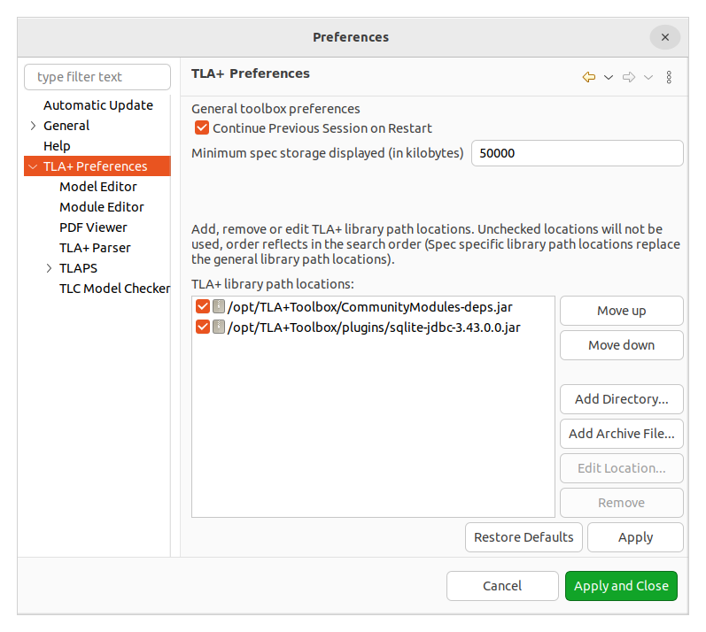
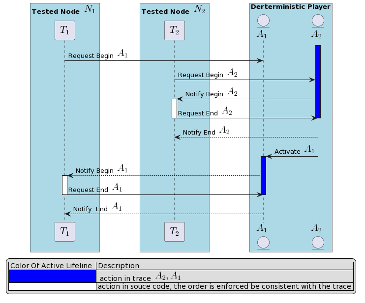

# How To Start

## Write TLA+ Specification

Before writing a TLA+ specification, 
you need to configure the [TLA+ toolbox](https://lamport.azurewebsites.net/tla/toolbox.html) to install additional dependent community modules.

Follow these steps to set it up:

1. Download the [CommunityModules-dep.jar](https://github.com/scuptio/TLAPlusCommunityModules/releases)

2. In tla+ toolbox, go to

   File -> Preferences -> TLA+ Preference

   Specify TLA+ library path option locations




## Run TLA+ model checker and generate a dump output (.dot) of the TLA+ model.

1. Filling Model checker setting:
   
   Specify constant value and Temporal formula 

   Specify TLC command parameter:

      Additional TLC Option -> Parameters -> TLC command line parameter ->

      -dump dot _file_name_.dot

2. Click then "Runs TLC on the model" Button

   After the model checker finishes running, navigate to the folder:
      
   /_xxxx_/_xxxx_/_xxxx_.toolbox/Model\__xxxx_ 

## Development by specification


### Generate a trace from the .dot file that was dumped by the TLA+ toolbox.


A trace is a finite sequence of actions. An action is a step of state transition. We define several action types based on their functionalities.
The action types include:


| Action Type	  | Description of Action Type 	                                                                    |
|---------------|-------------------------------------------------------------------------------------------------|
| Setup         | Set up and initializes the state of a node                                                      |
| Check         | Check the state correctness of a node, used for asserting invariants                            |
| Input         | Represent a node receiving an input message, from a network endpoint or a terminal, for example |
| Output        | Represent a node sending an output message, to a network endpoint or a terminal, for example    |
| Internal      | Represent an internal event in a node                                                           |


Use the [trace-gen](../src/trace_gen/bin/main.rs) to traversal dot file(like [this dot file](../src/data/toolbox_dump.dot)) 
and dump all trace into a database(e.g., [sqlite DB file](../src/data/trace.db))
The trace format is represented in JSON, similar to [this JSON file](../src/data/trace2.json)
The [action incoming interface](../src/player/action_incoming.rs) can be used to read traces.


The trace_gen's command lines:

``` 
Usage: trace_gen [OPTIONS] --dot-path <DOT_PATH>

Options:
  -d, --dot-path <DOT_PATH>
          Path of the TLA+ output .dot file
  -o, --out-db-path <OUT_DB_PATH>
          Type name of the actions
  -m, --map-const-path <MAP_CONST_PATH>
          Path of the json file stores the constant value map
  -r, --remove-intermediate
          Remove the intermediate table that records TLA+ actions and trace paths after generating the trace
  -h, --help
          Print help
  -V, --version
          Print version
```

`-map-const-path` parameter can be used to specify a JSON file that maps TLA+ constant values to code primitive types in the source code.

A example JSON file can be like:

```
{
    "A_n1" : 1,
    "A_n2" : 2,
    "x" : 1000
}
```

The following command lines parse [toolbox_dump.dot](../src/data/toolbox_dump.dot) and generate output trace to [trace.db](../src/data/trace.db)


```
trace-gen --dot-path [PREFIX]/toolbox_dump.dot --out-db-path [PREFIX]/trace.db --map-const-path [PREFIX]/map_const.json 
```


### Insert *anchor action*s to the testing source code

We define certain *anchor actions* that allow us to send a message to the *deterministic player* for reordering the actions.

The figure below illustrates how the *deterministic player* reorders the actions based on predefined orders.



The physical system will align with the logical model, ensuring consistency. 
Our framework incorporates various macros to facilitate the implementation of *anchor actions* 
that verify the coherence between our source-level implementation and abstract-level design.


The *anchor actions* include server macros:

- *auto_init*:  Enable an automata

- *auto_clear*:  Clear an automata

- *action_begin*:  Begin an action

- *action_end*: End an action 

- *setup_begin* : Begin a Setup action

- *setup_end* :  End a Setup action

- *setup*:  The same as *setup_end*

- *setup_begin* : Begin a Check action

- *setup_end* :  End a Check action

- *check*:  The same as *check_end*

- *input_begin* : Begin an Input action

- *input_end* :  End an Input action

- *input*:  The same as *input_end*

- *output_begin* : Begin an Output action

- *output_end* : End an Output action

- *output*:  The same as *output_begin*

- *internal_begin* : Begin an Internal action

- *internal_end* : End an Internal action

These macros are defined in [automata.rs](../src/player/automata).

An example using *anchor actions* could be found in [test_dtm_player.rs](../src/player/test_dtm_player.rs).


### Generate code stubs from Action DSL

To simplify development, we have created a tool set that automatically generates Rust code.
This tool set includes an Action language and a command-line tool.
The Action language is a domain-specific language (DSL) defined by [grammar.js](../src/tree-sitter-action/grammar.js)
It is used to guide the generation of Rust code for specification-driven testing. 
The *Action* can be written in TLA+ specification files and are enclosed in comments marked by **(\*@Begin@** and **@End@\*)** .
The [rust-gen](../src/rust_gen/bin/main.rs) tool can read automata definitions from *Action*s and generate Rust code
stubs.

Here is the rust_gen command line:

```
Usage: rust_gen [OPTIONS] --action-path <ACTION_PATH>

Options:
  -a, --action-path <ACTION_PATH>  .action or .tla+ file path
  -o, --output-path <OUTPUT_PATH>  output rust code file path
  -h, --help                       Print help
  -V, --version                    Print version

```


### Implement the Rust code

### Add assert invariants to the testing source code

During testing, we add invariants to assert the correctness of our assumptions.
