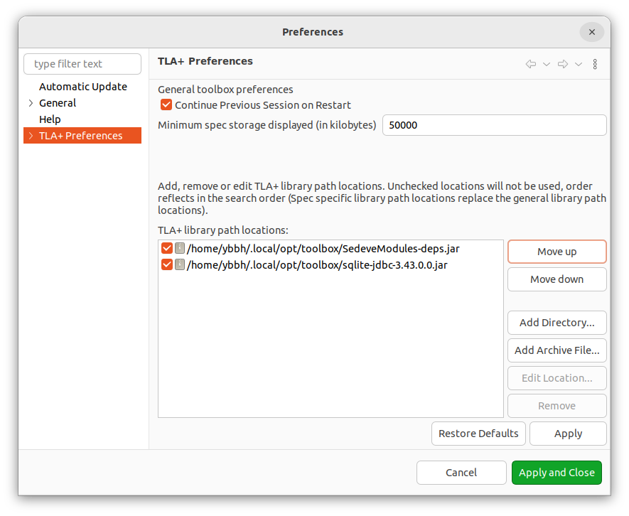

# How To Start

## Configure TLA+ toolbox

Before writing a TLA+ specification, 
you need to configure the [TLA+ toolbox](https://lamport.azurewebsites.net/tla/toolbox.html) to install additional dependent community modules.

Follow these steps to set it up:

1. 
Download the [SedeveModules jar](https://github.com/scuptio/SedeveModules/releases)
We developed  TLA+ modules 
[StateDB](https://github.com/scuptio/SedeveModules/blob/master/modules/StateDB.tla), 
[GenID](https://github.com/scuptio/SedeveModules/blob/master/modules/GenID.tla) .

Download the [SQLite JDBC driver jar](https://github.com/xerial/sqlite-jdbc/releases/download/3.45.3.0/sqlite-jdbc-3.45.3.0.jar)

2. In tla+ toolbox, go to

   File -> Preferences -> TLA+ Preference

   Specify TLA+ library path option of *SedeveModules*,  *SQLite JDBC driver*



## Write TLA+ specification

In the TLA+ specification, we use 
[InitAction](https://github.com/scuptio/tlaplus-specification/blob/main/spec/action.tla#L187) 
and 
[SetAction](https://github.com/scuptio/tlaplus-specification/blob/main/spec/action.tla#L209)
to specify the action of [I/O automata](doc/model_the_system.md) and output the state to sqlite database.


## Run TLA+ model checker and generate state database(a sqlite file).

1. Filling Model checker setting:
   
   Specify constant value and Temporal formula

2. In `Model` -> `TLC Options` Page ->  `Parameters` -> `JVM arguments:` box:

   Specify Java property parameter "tlc2.overrides.TLCOverrides" by filling the text,

``` 
-Dtlc2.overrides.TLCOverrides=tlc2.overrides.TLCOverrides:tlc2.overrides.SedeveTLCOverrides
```

   The "tlc2.overrides.TLCOverrides" is used by thethe [ComunityModeules](https://github.com/tlaplus/CommunityModules); and "the tlc2.overrides.SedeveTLCOverrides" is used by [SedeveModules](https://github.com/scuptio/SedeveModules/)

3. Click then `Runs TLC on the model` Button
 

## Development by specification


### Generate a trace from the sqlite state database that was output by the TLA+ toolbox.


A trace is a finite sequence of actions. An action is a step of state transition. We define several action types based on their functionalities.
The action types include:


| Action Type	  | Description of Action Type 	                                                                    |
|---------------|-------------------------------------------------------------------------------------------------|
| Input | Represent a node receiving an input message, from a network endpoint or a terminal, for example |
| Output        | Represent a node sending an output message, to a network endpoint or a terminal, for example    |
| Internal      | Represent an internal event in a node                                                           |


Use the [trace-gen](../src/trace_gen/main.rs) to traversal state space
and dump all trace into a database(e.g., [sqlite DB file](../src/data/trace.db))
The trace format is represented in JSON, similar to [this JSON file](../src/data/trace2.json)
The [action incoming interface](../src/player/action_incoming.rs) can be used to read traces.


### Insert *anchor action*s to the testing source code

We define certain *anchor actions* that allow us to send a message to the *deterministic player* for reordering the actions.

The figure below illustrates how the *deterministic player* reorders the actions based on predefined orders.


The physical system will align with the logical model, ensuring consistency. 
Our framework incorporates various macros to facilitate the implementation of *anchor actions* 
that verify the coherence between our source-level implementation and abstract-level design.


### Implement the Rust code

### Add assert invariants to the testing source code

During testing, we add invariants to assert the correctness of our assumptions.


## Example
[Two-Phase Commit Protocol(2PC)](https://en.wikipedia.org/wiki/Two-phase_commit_protocol) is a atomic commit protocol.
The example of using this kit to develop 2PC could be found at [this repo](https://github.com/scuptio/example-2pc).